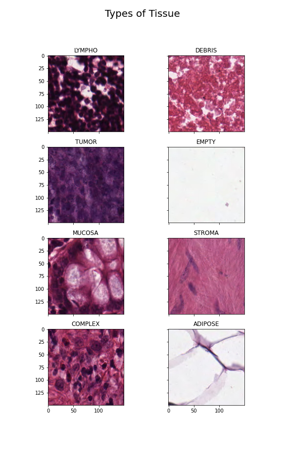
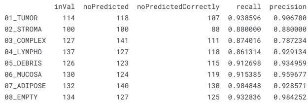
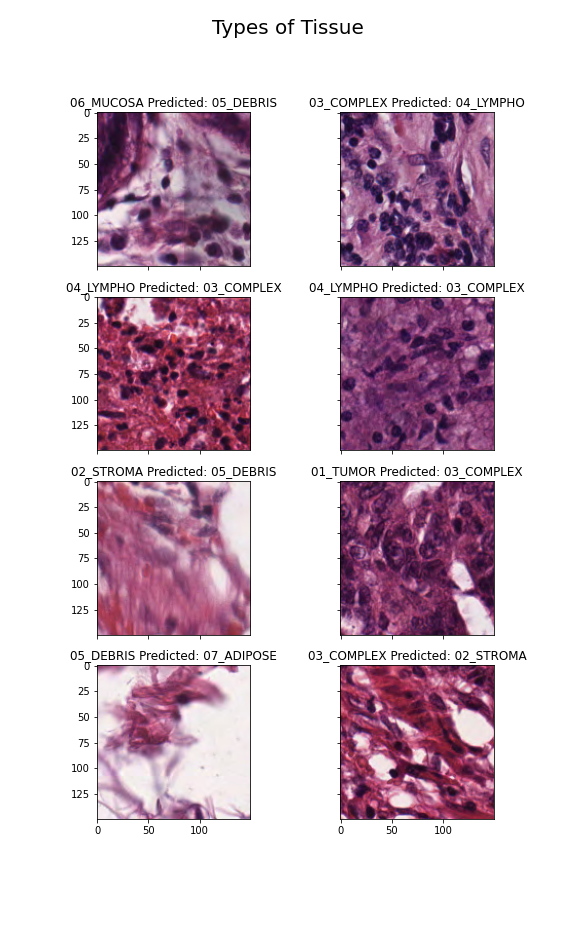
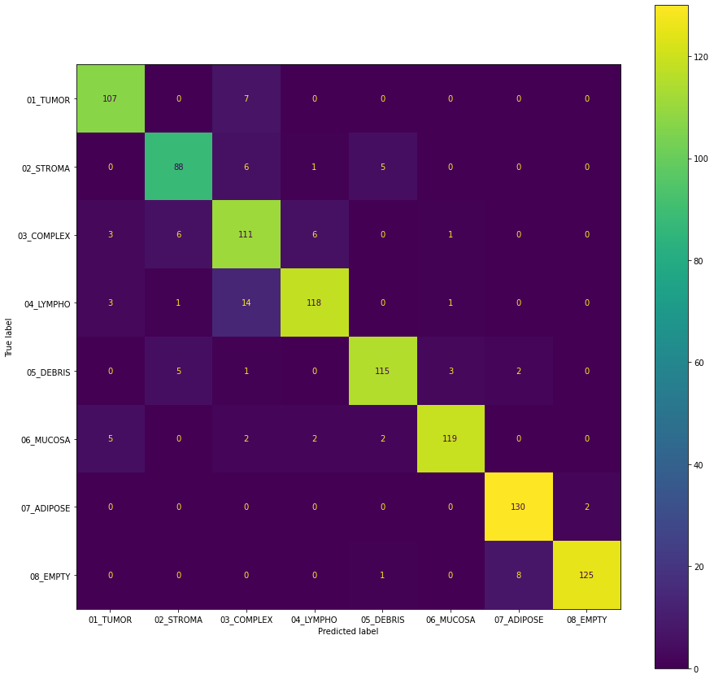
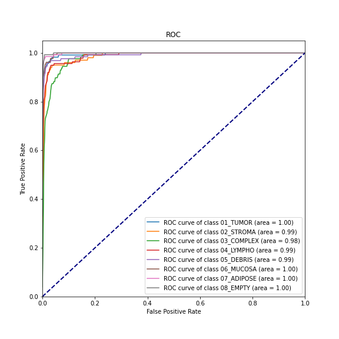
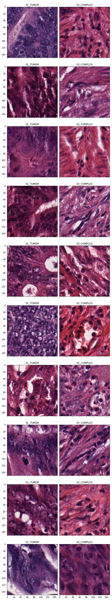

# Classification of Tissue Types from Colorectal Histology Images
## Classification of 7 tissue types, including tumors
___

This repo contains script for inference and classification of histology images from the following tissues:
tumor epithelium (tumor), immune cells (lympho), mucosal glands (mucosa), simple stroma (stroma), complex stroma 
(complex), and adipose. Details abot the data and its collections can be found in the source
below.

kaggle notebooks with exploratory data preparation and analysis are [here](https://www.kaggle.com/code/hectorlopezhernandez/colorectalhistologymodel)
and [here](https://www.kaggle.com/code/hectorlopezhernandez/analysis-colorectaldata)

# Classification of Colorectal Histology Images
## Classification of 7 tissue types, including tumors
___

This repo contains script to classify histology images from the following tissues:
tumor, lympho, mucosa, stroma, complex, and adipose.

# Models
1) Small network built from residual convolutional and identity blocks.

# Data

Trained on kaggle dataset [here](https://www.kaggle.com/datasets/kmader/colorectal-histology-mnist).
  
Citation:  
Kather JN, Weis CA, Bianconi F, Melchers SM, Schad LR, Gaiser T, Marx A, Zollner F: Multi-class texture analysis in colorectal cancer histology (2016), Scientific Reports (in press)

Example images for tissues and controls:  

# Performance
## Custom ResNet50 Inspired
### Precision and Recall
  
where inVal is number of images in validation set, noPredicted is TP+FP, and noPredictedCorrectly is TP.
### Example of Misclassified Images

### Confusion Matrix

### Analysis
The model performs decently well across the various classes. Most importantly, it performs well on the
recall of tumor tissues. Interestingly, all tumor tissues that were misclassified were classified as complex stroma, which
contain stroma plus "single tumour cells and/or few immune cells"[Kather et al.]. ROC curves and AUC in a one vs. rest analysis
demonstrate high performance with a steep curve and low FPR. 

If this model was to be considered in practice, it would be critical to achieve 100% recall of tumor tissues. I would
recommend both complex and tumor tissues for further analysis, given the presence of some tumor cells in the complex stroma
data. This classification strategy would compromise some precision to achieve 100% recall with our existing dataset 
on tumors. 

*A comparison on complex and tumor tissues from the dataset*  

The model performs decently well across the various classes. The addition of the complex 
tissues, results in the majority of misclassification events (precision of complex tissue < 79%). The complex tissue
is comprised of stroma, with tumor and immune cells. Based on the data collection, there is likely overlap in the features 
of complex images with stroma, tumor, and immune cells. This overlap is obvious in the results, where complex tissues
was misclassified as tumors (7/114), immune cells (14/127), and 6/100 (stroma). 
simple stroma tissues.

Here is a comparison on complex and tumor tissues from the dataset.  

